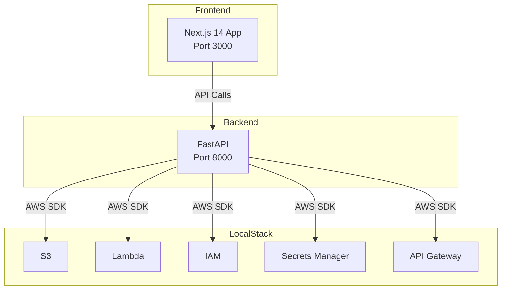

# Damn Vulnerable Trust Center (DVTC)

**Version 0.1 - API Edition**

Intentionally vulnerable trust center application for security education and CTF competitions.

**WARNING: Contains intentional security vulnerabilities. DO NOT deploy in production.**


## What is DVTC

Educational platform for learning security through exploitation of a realistic trust center application. This version focuses on API vulnerabilities and cloud misconfigurations.

12 challenges | 2,150 points

## Quick Start

### Prerequisites
- Docker & Docker Compose
- 8GB+ RAM
- Ports 3000, 8000, 4566 available

### Installation

```bash
git clone https://github.com/ethanolivertroy/DamnVulnerableTrustCenter.git
cd DamnVulnerableTrustCenter
make init && make up
```

### Access
- Frontend: http://localhost:3000
- Backend API: http://localhost:8000/api/docs
- LocalStack: http://localhost:4566
- CTF: http://localhost:3000/ctf

## Architecture



## Challenges

| ID | Challenge | Category | Points |
|----|-----------|----------|--------|
| FLAG01 | Leaky Presigned URL | Cloud Storage | 100 |
| FLAG02 | Secrets Manager Loot | IAM/Secrets | 200 |
| FLAG03 | Template Traversal | Serverless | 200 |
| FLAG04 | Machine-Readable Overshare | OSINT/Metadata | 150 |
| FLAG05 | Badge Falsification | Frontend Logic | 150 |
| FLAG06 | CI/CD From Forks | Supply Chain | 250 |
| FLAG07 | Admin Trail For All | API Auth | 200 |
| FLAG08 | Chatbot Prompt Injection | AI Security | 200 |
| FLAG09 | Stale Fork Secrets | S3 Versioning | 150 |
| FLAG10 | Compliance Override | Business Logic | 300 |
| FLAG11 | Debug Mode Exposed | Info Disclosure | 100 |
| FLAG12 | Weak Session Tokens | Authentication | 150 |

**Total:** 12 Challenges | 2,150 Points

See [SOLUTIONS.md](SOLUTIONS.md) for walkthroughs.

## Commands

```bash
make up              # Start all services
make down            # Stop all services
make logs            # View logs
make clean           # Remove containers and volumes
make flags           # Show CTF flag titles
make health          # Check service health
```

## Example Exploits

Exposed debug endpoint:
```bash
curl http://localhost:8000/api/debug
```

Client-side badge manipulation:
```javascript
window.__BADGES_OVERRIDE = {fips_encryption: 'ok'}
```

Long-lived presigned URLs:
```bash
curl "http://localhost:8000/api/reports/presigned?file=internal-report.pdf&expiry=604800"
```

Unauthenticated admin access:
```bash
curl http://localhost:8000/api/admin/downloadAuditTrail
```

## Troubleshooting

### FLAG03 Lambda errors
LocalStack Lambda doesn't work in Docker-in-Docker. The challenge was moved to `/api/reports/generate`:

```bash
curl -X POST "http://localhost:8000/api/reports/generate?template=../etc/passwd"
```

### LocalStack not starting
```bash
curl http://localhost:4566/_localstack/health
make localstack-logs
```

### Out of memory
Increase Docker memory: Docker Desktop > Settings > Resources > Memory: 8GB+

## Disclaimer

This application intentionally contains hardcoded credentials, injection vulnerabilities, authentication bypasses, information disclosure flaws, insecure direct object references, broken access controls, and other security vulnerabilities.

NEVER use any code, patterns, or configurations from this project in production.

## License

MIT License - See LICENSE file

## Credits

Inspired by OWASP WebGoat, DVWA, and Juice Shop.

Thanks to [@networkbm](https://github.com/networkbm) for testing early versions.
