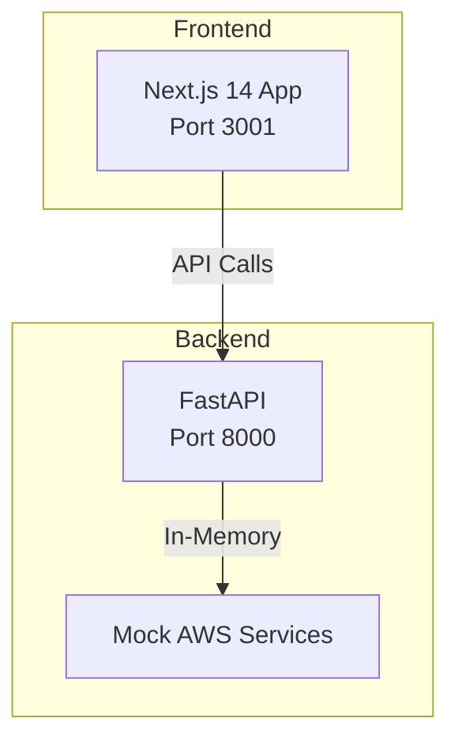

# Damn Vulnerable Trust Center (DVTC)

**Version 0.2 - Simplified Edition**

Intentionally vulnerable trust center application for security education and CTF competitions.

**WARNING: Contains intentional security vulnerabilities. DO NOT deploy in production.**


https://github.com/user-attachments/assets/a3272bd0-5f28-4f4a-b9df-c43dde9d7224


## What is DVTC

Educational platform for learning security through exploitation of a realistic trust center application. This version focuses on API vulnerabilities and cloud misconfigurations.

12 challenges | 2,150 points

## Quick Start

### Prerequisites
- Docker & Docker Compose
- 2GB+ RAM
- Ports 3001, 8000 available

### Installation

```bash
git clone https://github.com/ethanolivertroy/DamnVulnerableTrustCenter.git
cd DamnVulnerableTrustCenter
make init && make up
```

Services start in ~30 seconds.

### Access
- Frontend: http://localhost:3001
- Backend API: http://localhost:8000/api/docs
- CTF: http://localhost:3001/ctf

## Architecture


```mermaid
graph TB
    subgraph "Frontend"
        A[Next.js 14 App<br/>Port 3001]
    end

    subgraph "Backend"
        B[FastAPI<br/>Port 8000]
        C[Mock AWS Services]
    end

    A -->|API Calls| B
    B -->|In-Memory| C
```

The backend uses in-memory mock AWS services (S3, Secrets Manager) instead of LocalStack for faster startup and simpler deployment.

## Challenges

| ID | Challenge | Category | Points |
|----|-----------|----------|--------|
| FLAG01 | Leaky Presigned URL | Cloud Storage | 100 |
| FLAG02 | Secrets Manager Loot | IAM/Secrets | 200 |
| FLAG03 | Template Traversal | Serverless | 200 |
| FLAG04 | Machine-Readable Overshare | OSINT/Metadata | 150 |
| FLAG05 | Badge Falsification | Frontend Logic | 150 |
| FLAG06 | CI/CD From Forks | Supply Chain | 250 |
| FLAG07 | Admin Trail For All | API Auth | 200 |
| FLAG08 | Chatbot Prompt Injection | AI Security | 200 |
| FLAG09 | Stale Fork Secrets | S3 Versioning | 150 |
| FLAG10 | Compliance Override | Business Logic | 300 |
| FLAG11 | Debug Mode Exposed | Info Disclosure | 100 |
| FLAG12 | Weak Session Tokens | Authentication | 150 |

**Total:** 12 Challenges | 2,150 Points

See [SOLUTIONS.md](SOLUTIONS.md) for walkthroughs.

## Commands

```bash
make up              # Start all services
make down            # Stop all services
make logs            # View logs
make clean           # Remove containers and volumes
make flags           # Show CTF flag titles
make health          # Check service health
```

## Example Exploits

Exposed debug endpoint:
```bash
curl http://localhost:8000/api/debug
```

Client-side badge manipulation:
```javascript
window.__BADGES_OVERRIDE = {fips_encryption: 'ok'}
```

Long-lived presigned URLs:
```bash
curl "http://localhost:8000/api/reports/presigned?file=internal-report.pdf&expiry=604800"
```

Unauthenticated admin access:
```bash
curl http://localhost:8000/api/admin/downloadAuditTrail
```

## Troubleshooting

### Backend not starting
```bash
make logs
docker compose logs backend
```

### Port already in use
Change the port in docker-compose.yml or stop the conflicting service.

### Frontend can't connect to backend
Ensure both services are healthy:
```bash
make health
```

## Disclaimer

This application intentionally contains hardcoded credentials, injection vulnerabilities, authentication bypasses, information disclosure flaws, insecure direct object references, broken access controls, and other security vulnerabilities.

NEVER use any code, patterns, or configurations from this project in production.

## License

MIT License - See LICENSE file

## Credits

Inspired by OWASP WebGoat, DVWA, and Juice Shop.

Thanks to [@networkbm](https://github.com/networkbm) for testing early versions.
